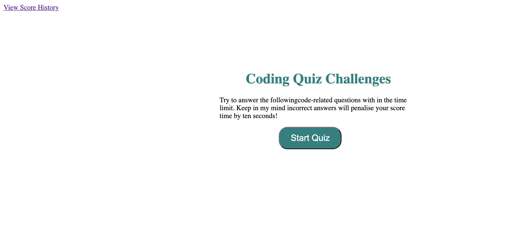
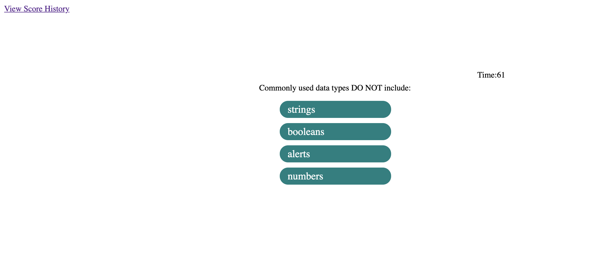
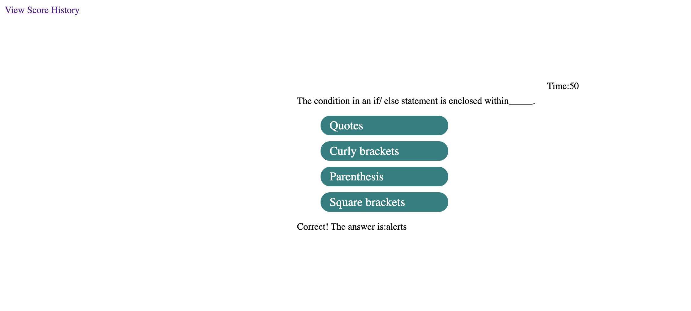
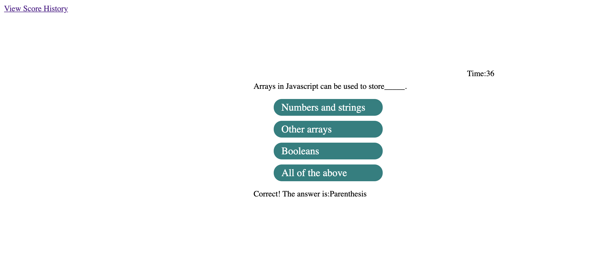
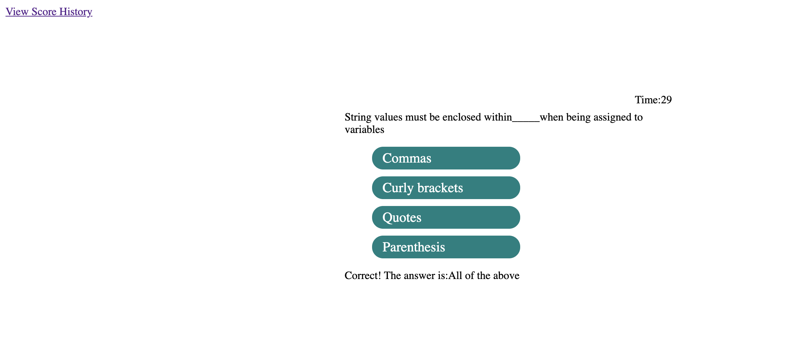
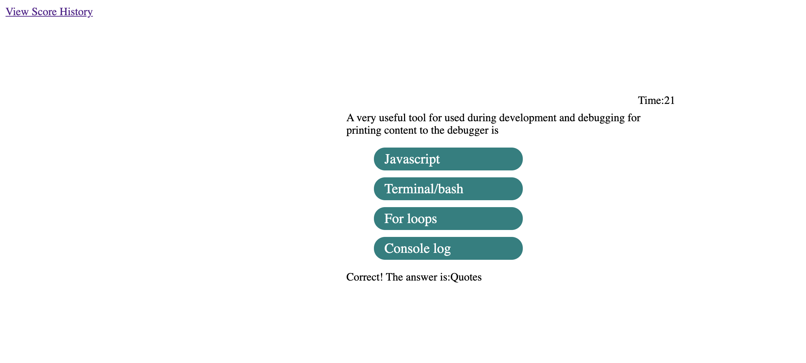
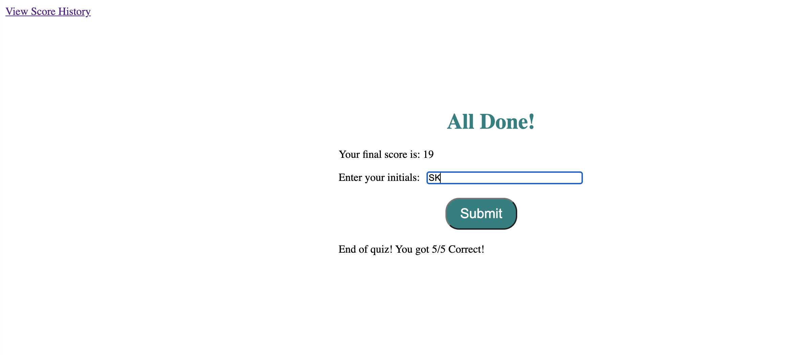
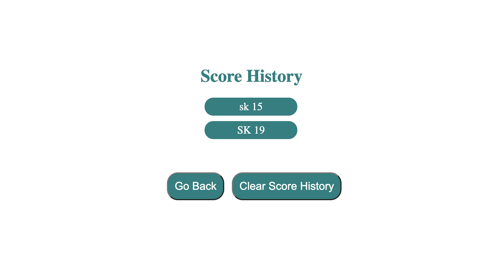

### Name of the Project: ###
Code Quiz

### Description: ###
This is a timed coding quiz with multiple-choice questions. This app will run in the browser and
will feature dynamically updated HTML and CSS powered by JavaScript code.

### Motivation: ###
The motivation behind this project is to learn and demonstrate HTML, CSS and Javascript coding skills.

### Technologies used: ###
    * HTML
    * CSS
    * Visual Studio Code Editor
    * Javascript

### Website Screen Shots: ###

### Website Contents: ###
1. The Code quiz will start, when the start button is clicked.
2. A timer starts and questions with multiple choices are displayed on the screen.
3. For every wrong answer, 10 seconds will be deducted from the timer. 
4. The game ends When all questions are answered or the timer reaches 0. 
5. At the end user can save initionals and scores and it can be viewed in the Score history page.

Live deployed link:
https://sarasuni.github.io/sk-assignment-04/
